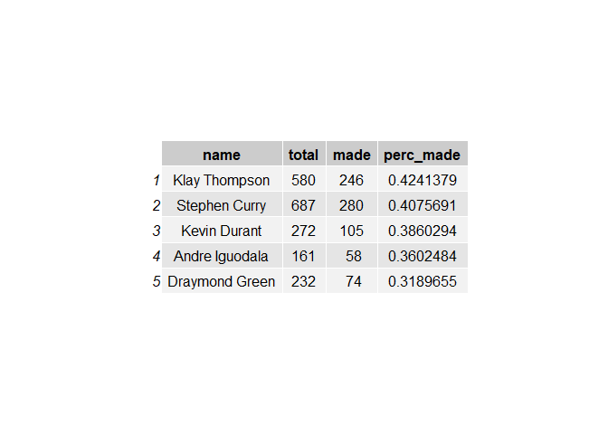

A Shooting Stat Look at Golden State
================
Merryle Wang


We all know that the Golden State Warriors in the 2015-2016 NBA season
were already one of the best shooting teams in NBA history, highlighted
by the Splash Bros: Steph and Klay. Yet with the addition of free agent
Kevin Durant, the Warriors reached new heights of offensive prowess. In
this statistical report, we dive into their 2016-2017 season’s shooting
stats, and we can see whether or not this superteam has lived up to the
hype. We will look at each of the death lineup’s-Steph Curry, Klay
Thompson, Kevin Durant, Andre Iguodala, and Draymond Green-shooting
statistics for both two’s and three’s, as well as their complete shot
chart on the season.

### Motivation

The NBA has the luxury of being such a easily quantifiable sport. With
cameras and statheads abound, each move on the court can be tracked.
Taking advantage of this, we can investigate whether or not the shot
data backs up what we believe the Golden State Warriors to be. By
digging into the shot charts as well as each player’s shooting
percentages, we can better understand the player’s ability and play
style, as well as a brief scouting report of the Warriors.

### Background

Homegrown Steph Curry and Klay Thompson have developed into the core of
the Golden State offense, torching opposing teams from the outside in.
With their unprecedented amount of three pointers taken-at least in that
year-and their high accuracy despite the difficulty of their shots, they
have represented the Warriors offense for a couple years now. Draymond
Green has recently become an All Star caliber player, but we do know
that his scoring ability pales compared to the two starting guards.
Andre Iguodala, a veteran, comes off the bench, yet he finishes games
along with the other All Stars on this team. He, like Draymond, is not
the focus of the offense, yet he plays his role well, complementing the
others. Lastly, the new guy, Kevin Durant, the 2014 NBA MVP, has brought
a new dimension to the Warriors’ offense.
/cdn.vox-cdn.com/uploads/chorus_image/image/62317521/durant_draymong_getty_ringer.0.jpg)Previously
known for his isolation ability and just his bucket-getting in general,
Durant spent this season meshing with the team, and getting used to the
easy shots that come his way with the ball movement and fluidity that
the Warriors’ offense performs with.

### Data

This is the data we used for this report. We don’t use all of the
information, instead focusing on who took the shot, where it was taken,
and whether it was made or not.

``` r
shots <- read.csv("../data/shots-data.csv",stringsAsFactors = FALSE)
shots[sample(nrow(shots),10),c("name", "shot_made_flag", "minute")]
```

    ##                name shot_made_flag minute
    ## 1660  Stephen Curry       shot_yes     36
    ## 3815   Kevin Durant        shot_no     12
    ## 2528  Klay Thompson        shot_no     39
    ## 2191  Stephen Curry        shot_no     48
    ## 3418  Klay Thompson        shot_no     15
    ## 614  Draymond Green        shot_no     36
    ## 3205  Klay Thompson       shot_yes     13
    ## 1717  Stephen Curry        shot_no     22
    ## 1361  Stephen Curry        shot_no     30
    ## 2077  Stephen Curry       shot_yes     29

This is a brief sample of some rows and columns from our data file.

### Analysis

To perform computation and data analysis on the data, we used the R
programming language to write scripts that take the .csv files per
player, and generated graphs and tables that provide us insight into the
Warriors’ shooting. To generate the graph, we took every shot in the
half court that each player took this season and plotted it onto an
image of an NBA half court for a more insightful viewing experience.
Then the shots that were missed and the shots that were made are
distinctly colored so that it is simple for the viewer to tell how the
player shoots. We then quantified and counted for the reader the number
of shots that the individual players took and made. Using R, we formed
tables that show each player’s shooting percentages on two’s, three’s,
and overall this season. These tables give us a better understanding and
numbers behind the graph

#### Effective Shooting % by Player

``` r
#overall
overall <- shots %>% group_by(name) %>% summarise(total = n(),
 made = sum(shot_made_flag == "shot_yes")) %>% mutate(perc_made = made / total) %>% arrange(desc(perc_made))
grid.table(overall)
```

<!-- -->

#### 2PT Effective Shooting % by Player

``` r
#2pt
twos <- shots %>% group_by(name) %>% filter(shot_type == "2PT Field Goal")%>% summarise(total = n(),
 made = sum(shot_made_flag == "shot_yes")) %>% mutate(perc_made = made / total) %>% arrange(desc(perc_made))

grid.table(twos)
```

<!-- -->

#### 3PT Effective Shooting % by Player

``` r
#3pt
threes <- shots %>% group_by(name) %>% filter(shot_type == "3PT Field Goal")%>% summarise(total = n(),
 made = sum(shot_made_flag == "shot_yes")) %>% mutate(perc_made = made / total) %>% arrange(desc(perc_made))

grid.table(threes)
```

<!-- -->

#### Each member of the Death Lineup Shot Chart

``` r

```

<!-- -->

### Discussion

If we take a look at the Shot Chart, immediately we see how little shots
Iguodala and Green take compared to the other more flashy stars on the
Golden State’s death lineup. Iguodala, clearly the last option on
offense, gets most of his buckets at the rim and beyond the three point
arc. This is typical of most role players, as they usually depend on
other players to get them their buckets, so the three and the layup/dunk
are the best options for the role players to take. Green, also fits this
criteria, as although he takes more shots than Iguodala, his shots are
even more clustered around the three point line and underneath the
basket. For these two players, this fits our anecdotal knowledge of
their play. Neither of the two score very much, nor do they need to,
relegating themselves to setting up the other players with their high
basketball IQ plays. Draymond especially is not a good scorer, as there
are a lot of orange dots-misses-on his shot chart.

If we turn to Thompson and Curry, we see that their shot charts are
similar to each others. Both have about the same amount of green and
orange dots, and they are very spread out, scoring from all areas of the
court. Curry’s shot chart stretches a little further out than Thompson,
which to anyone who saw Curry’s deep threes during this season, comes
with no surprise. Thompson has more shots around the midrange, which
also fits the storyline that he has developed as a player. Known more of
an offball shooter, Klay usually runs around screens for catch and shoot
threes, or one-dribble pull ups.

Durant, as a near 7 footer, has a much higher concentration of made
shots around the rim, but his three point shot isn’t slacking either.
Still, Durant is known for his isolation scoring ability, which ends up
usually in a midrange shot. It appears though, that Durant has the plug
in and play ability that any great player has. He hasn’t missed a beat
during his first season at Golden State, and while his usage rate, and
the number of shots he takes has gone down, his efficiency has increased
as of result of playing with such talented shooting teammates.

If we now expand our discussion to the tables of the player’s shooting
percentage, we can see more details about the Warriors’ shooting that we
couldn’t see before. Just looking at the first table, each player’s
overall field goal percentage, we that Durant is indeed the most
accurate. This is likely buffered by the fact that Durant takes less
three’s than Klay or Steph. Looking at the second table, which is each
player’s two pointer percentage, we see that this is true. Durant, while
taking less shots overall, has taken the most two point shots, making 61
more than the closest player: Klay. Lastly, on examination of the last
table, each player’s three point percentage, we see that three pointers
are actually a weaker point in Durant’s game, despite still being an
above average shooter.

Here, we see that Klay and Steph thrive from beyond the arc, both
hitting them at an elite rate of over 40%. Because they take so many
three’s, which are more difficult to hit shots than two’s, we see that
it drops their overall shooting percentage also, even though they are
both known as elite shooters. Steph shoots about 41% on threes and 54%
on two’s, but his overall shooting percentage is 47%. Klay experiences
the same drop, shooting 42% on threes and 51% on two’s resulting in 47%
overall.


Anecdotally, we know that Draymond is not as great at scoring as the
others, and the stats back it up. Draymond is at the bottom of all of
the shooting percentage tables. He shoots a poor 32% from three, a sub
50% from two and just 42% overall. Luckily, his other attributes, like
his playmaking and defense, and the presence of such gifted offensive
players make his shooting grievances acceptable in the Warriors offense.

Like many other role players, Iguodala does not get too many shot come
his way, but unlike with Draymond, when shots do come his way, he shoots
efficiently. He shoots 36% from three, which although is fourth on our
tables, is still league average. His two pointers is where he shines,
shooting a leading 64%. Overall, he is at about 52% percentage which is
2nd on our table.

### Conclusion

Just by looking at the shots charts and stats, anyone with a brief
knowledge of basketball can imagine fairly correctly how the Golden
State offense runs. We see that Steph, Klay, and Durant take on the bulk
of the shots, each shooting efficiently despite receiving the defense’s
focus. Iguodala and Green benefit from this, getting primarily shots at
the rim or shots from behind the three point line. There is a large
focus on shooting three’s for this team, but they don’t stray away from
midrange shots. From the shot charts, we can see that both Durant and
Klay take many of their shots in the midrange, despite it being known as
a low efficiency area. Golden State is formidable because anyone of
Steph, Klay, or Durant can catch fire on any given night. With so much
star power to go around, the offense comes easy to them, and trusting
their teammates is usually the better option.

Still, with these minimal facts, it is not enough to paint the whole
picture of the Warriors offense. For example, without any knowledge of
how Draymond Green plays, we would have no idea that he was an all star.
The stats back up that Draymond is a replacement level player, one that
was just stuffed into the starting lineup because there were no better
options. This takes away from Draymond’s impact on the game and his true
abilities.

Stats do help scouts and fans know more about players and teams, but
basketball is not just a game of numbers. While it does help to use data
analysis to improve a team’s play, just as much impact is hidden from
the stats. Even with advanced stats that help paint an even clearer
picture of a team or player just with numbers, there is no replacing
watching the team for yourself or listening to an experienced reporter
or scout. Stats do, however, remove bias that the viewing experience
inherently produce, but stats can be taken out of context and handpicked
to produce bias.
